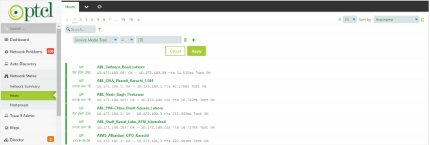

Welcome to Trace9 Monitoring - Query Builder's documentation!
**************************************************************

A. General Process
===================

1). Query Builder on Network Status > Network Summary
----------------------------------------------------------------------

Extracting site counts based on different parameters using query builder, steps are as follows:

i. Click on Network Status from the left-side menu and select Network Status from the menu list a view containing host and service count will appear. 
+++++++++++++++++++++++++++++++++++++++++++++++++++++++++++++++++++++++++++++++++++++++++++++++++++++++++++++++++++++++++++++++++++++++++++++++++++++++++++++++++++++

.. figure:: i01.PNG

ii. Click on the filter icon on the appeared window, a list of options will appear
+++++++++++++++++++++++++++++++++++++++++++++++++++++++++++++++++++++++++++++++++++

iii. You can select parameters based on your required data from this list. 
++++++++++++++++++++++++++++++++++++++++++++++++++++++++++++++++++++++++++++++

.. figure:: i03.PNG

2). Query Builder on Network Status > Hosts
--------------------------------------------------------
Extracting sites lists based on different parameters using query builder

i. Click on Network Status from the left-side menu and select Hosts from the menu list a view containing list of hosts will appear. 
+++++++++++++++++++++++++++++++++++++++++++++++++++++++++++++++++++++++++++++++++++++++++++++++++++++++++++++++++++++++++++++++++++++++++++++++++

ii. Click on the filter icon on the appeared window, a list of options will appear. 
++++++++++++++++++++++++++++++++++++++++++++++++++++++++++++++++++++++++++++++++++++

.. figure:: i05.PNG

iii. You can select parameters based on your required data from this list. 
++++++++++++++++++++++++++++++++++++++++++++++++++++++++++++++++++++++++++++

.. figure:: i06.PNG

B. General Filter Parameters
==============================

1). Site/Host parameter-based filtering 
-----------------------------------------

i. Basic Site/Host Parameters
++++++++++++++++++++++++++++++

#. **Host (Case insensitive):** The name of host/site to be searched.
#. **Host Address:** The IP Address of host/site to be searched.
#. **Host Check Source:** The zone of host/site to be searched.

   * For **zone-01**, add "**tfe02-v01-isat01**" or "**tfe3-v01-isat01**".
   * For **zone-02**, add "**tfe02-v03-isat03**" or "**tfe1-v01-isat01**".
   * For **zone-03**, add "**tfe02-v02-isat02**" or "**tfe3-v02-isat02**".
#. **Host Name:** The name of host/site to be searched.
#. **Host State:** The state of host/site to be searched.

   * For **UP**, add **0**.
   * For **DOWN**, add **1**.

ii. Site/Host SNMP Parameters
+++++++++++++++++++++++++++++++++
For SNMP parameter-based filtering use following parameters:

#. **Host Authtype:** The authentication type for SNMPv3 added in host/site. Can be:

   * MD5
   * SHA
#. **Host Authpass:** The password of authentication type for SNMPv3 added in host/site
#. **Host Privtype:** The privacy/security type for SNMPv3 added in host/site. Can be:

   * AES
   * DES
#. **Host Privpass:** The password of privacy/security type for SNMPv3 added in host/site.

   * authPriv
   * noAuthnoPriv
   * AuthnoPriv
#. **Host Password:** The password for SNMPv3 added in host/site.
#. **Host SNMP Version:** The SNMP version added in host/site. Can be:

   * SNMPv1
   * SNMPv2
   * SNMPv3
#. **Host SNMP Community:** The community string for SNMPv2 added in host/site.
#. **Host Username:** The username for SNMPv3 added in host/site.

iii. Site/Host Custom Parameters
++++++++++++++++++++++++++++++++++

For filtering on basis of custom properties use following parameters:

#. **Host Apn:** The APN added in host/site.
#. **Host Bandwidth:** The bandwidth added in host/site.
#. **Host Branch Code:** The branch code added in host/site.
#. **Host Branch Secondary Ip:** The branch secondary IP added in host/site.
#. **Host Branch Primary Ip:** The branch primary IP added in host/site.
#. **Host Exchange Secondary Ip:** The exchange secondary IP added in host/site.
#. **Host Exchange Primary Ip:** The exchange primary IP added in host/site.
#. **Host City:** The city added in host/site.
#. **Host Commissioning Date:** The commissioning date added in host/site.
#. **Host Device Model:** The device model added in host/site.
#. **Host Contact Info:** The contact Info added in host/site.
#. **Host Domain Name:** The domain name added in host/site.
#. **Host Dsl No:** The DSL number added in host/site.
#. **Host Geolocation:** The geolocation added in host/site.
#. **Host Lan IP:** The LAN IP added in host/site.
#. **Host Link Redundancy:** The link redundancy added in host/site.
#. **Host Local Exchange Name:** The local exchange added in host/site.
#. **Host Location:** The location added in host/site.
#. **Host Loopback Ip:** The loopback IP added in host/site.
#. **Host Radar:** The radar added in host/site (only for radar sites).
#. **Host Region:** The region added in host/site.
#. **Host Ptcl Region:** The PTCL region added in host/site.
#. **Host SLA:** The SLA added in host/site.
#. **Host Service Type:** The service type added in host/site.
#. **Host Serial:** The serial added in host/site.
#. **Host Sim Mdn:** The MDN added in host/site.
#. **Host Sim Ccid:** The CCID added in host/site.
#. **Host Site:** The site added in host/site.
#. **Host System Name:** The system name added in host/site.
#. **Host System Description:** The system description added in host/site.
#. **Host Termination Date:** The termination date added in host/site.
#. **Host Vendor Name:** The vendor name added in host/site. Can be Huawei, cisco, Fortinet etc.
#. **Host Wan Ip:** The WAN IP added in host/site.

iv. Site/Host POC Parameters
++++++++++++++++++++++++++++++
For POC based filtering use following parameters

#. **Host Customer Poc Email:** The customer POC email added in host/site.
#. **Host Customer Poc Name:** The customer POC name added in host/site.
#. **Host Customer Poc Phone:** The customer POC phone added in host/site.
#. **Host Onsite Poc Name:** The onsite POC name added in host/site.
#. **Host Onsite Poc Phone:** The onsite POC phone added in host/site.
#. **Host Ptcl Poc Email:** The PTCL POC email added in host/site.
#. **Host Ptcl Poc Name:** The PTCL POC name added in host/site.
#. **Host Ptcl Poc Phone:** The PTCL POC phone added in host/site.
#. **Host Vendor Poc Email:** The vendor POC email added in host/site.
#. **Host Vendor Poc Name:** The vendor POC name added in host/site.
#. **Host Vendor Poc Phone:** The vendor POC phone added in host/site.

v. Site/Host Customer Parameters
++++++++++++++++++++++++++++++++++
For Customer based filtering use following parameters

#. **Host Host Customer:** The name of the customer added in customer field of host/site.
#. **Hostgroup (Case-sensitive):** The name of the Hostgroup field added in customer field of host/site.
#. **Hostgroup Alias (Case-sensitive):** The name of the Hostgroup field added in customer field of host/site.
#. **Hostgroup Name:** The name of the customer added in Hostgroup field of host/site.

2). Service parameter-based filtering 
--------------------------------------

i. Service Basic Parameter
++++++++++++++++++++++++++++

#. **Service (Case-sensitive):** The service name added in host. Basic service names are as follows:

   * Availability
   * Discovery
   * ICMP-Interface*
   * SNMP-Interface*
   * Status-CPU
   * Status-Memory
   * Status-Jitter
   * Status Temperature

   *** is used for wild card, in above case it can be 1,2 or anything**

#. **Service Description:** The description added in service.
#. **Service Display Name (Case Sensitive):** The service name added in host. Basic service names are as follows:

   * Availability
   * Discovery
   * ICMP-Interface*
   * SNMP-Interface*
   * Status-CPU
   * Status-Memory
   * Status-Jitter
   * Status Temperature
   
   *** is used for wild card, in above case it can be 1,2 or anything.**
 

   

ii. Interface Service Specific Parameters
++++++++++++++++++++++++++++++++++++++++++++
#. **Service Crm Service Id:** The CRM service ID added in interface service.
#. **Service Dsl No:** The DSL number added in interface service. (Only for DSL sites)
#. **Service Exchange Name:** The exchange name added in interface service.
#. **Service Interface Type:** The interface type added in interface service. Can be:

   * Primary
   * Secondary
   * Tertiary
   * Quaternary (Fourth)
   * Quinary (Fifth)
   * Senary(Sixth)
   * Management
#. **Service Interface Ip:** The interface IP address added in interface service. (Only for ICMP services)
#. **Service Media Type:** The media type added in interface service. Can be:
   
   * DRS
   * DSL
   * Fiber
   * LTE
   * VSAT
#. **Service Media Vendor:** The 3rd party media vendor added in interface service.
#. **Service Pe Interface:** The PE Interface added in interface service.
#. **Service Pe Router Address:** The PE Router Address added in interface service.
#. **Service Pe Router Name:** The PE Router Name added in interface service.
#. **Service Services Type:** The service type added in interface service. Can be:

   * MPLS
   * PIB
#. **Service SNMP Interface:** The IP address or name of interface added in interface service. (Only available for SNMP service)
#. **Service Transmission Port ID:** The transmission port ID added in interface service.
#. **Service Use Ip Address:** The Boolean check added in interface service for determining if it is using interface name or interface IP for data fetching. Can be:

   * true
   * false
#. **Service Vlan:** The VLAN added in interface service.

C. Specific Filter Parameters – Network Summary
================================================
Some filter parameters which are specific to the Network Summary interface

#. **Host:** The name of host/site to be searched.
#. **Host Alias:** The name of host/site to be searched.
#. **Service:** The service name added in host. Basic service names are as follows:

   * Availability
   * Discovery
   * ICMP-Interface*
   * SNMP-Interface*
   * Status-CPU
   * Status-Memory
   * Status-Jitter
   * Status Temperature

*** is used for wild card, in above case it can be 1,2 or anything.**

D. Basic Operations 
=======================

1) AND, OR, NOT
------------------

i. AND Operator
++++++++++++++++++++
If AND operator is added in between two parameters then if both statements are true, result of query will be displayed.

ii. OR Operator
++++++++++++++++
If OR operator is added in between two parameters if any one statement is true, then result of query will be displayed.

iii. NOT Operator
+++++++++++++++++++
If NOT operator is added in between two parameters one should be true and other should be false.

2). = , !=, >, <, >=, <=
---------------------------

i. = Operator
+++++++++++++++
This operator is added if parameter value added in host/service is equal or like provided value.

ii. != Operator
++++++++++++++++
This operator is added if parameter value added in host/service is not equal or not like provided value.

iii. > Operator
+++++++++++++++++

This operator is added if parameter value added in host/service is greater than provided value. (Mostly use in case of numeric data)

iv. < Operator
+++++++++++++++
This operator is added if parameter value added in host/service is less than provided value.(Mostly use in case of numeric data)

v. <= Operator
+++++++++++++++
This operator is added if parameter value added in host/service is greater than or equal to provided value. (Mostly use in case of numeric data)

vi. >= Operator
++++++++++++++++
This operator is added if parameter value added in host/service is greater than provided value. (Mostly use in case of numeric data)

E. Wild Card Search
=====================

1). *
--------

   **i.** If we add **Khushali*** in the value panel, it will return all the records in which provided parameter value starts with **Khushali** keyword.

   **ii.** If we add **Khushali*** in the value panel, it will return all the records in which provided parameter value has **Khushali** keyword in it.

   **iii.** If we add **Khushali*** in the value panel, it will return all the records in which provided parameter value ends with **Khushali** keyword.

2). **
--------
   * Adding this will return all the records in which provided parameter value is not null.

F. Sort By
============
Sort By dropdown provides sorting based on available parameters. Available parameters are as follows:

   **i.** Hostname

   **ii.** Severity

   **iii.** Current State

   **iv.** Address

   **v.** Last Check

   **vi.** Last State Change

G. Example Use Cases
=====================

1) Count of hosts based on region
-----------------------------------

* Select **“Host Region”** from the filter parameters in Network Summary window, add **“=”** in operator panel, you can specify different values for different regions in the value panel.

* Add **“North”** in the value panel for filtering north region sites/hosts. 

* Add **“South”** in the value panel for filtering south region sites/hosts.

* Add **“Central”** in the value panel for filtering central region sites/hosts. 

.. figure:: i09.PNG

2) List of sites based on media type
--------------------------------------

* Select **“Service Media Type”** from the filter parameters in Hosts window and add **“=”** in operator panel, you can specify different values for different media types in the value panel:

* Add **“Fiber”** in the value panel for filtering sites/hosts where link media type is Fiber . 

.. figure:: i10.PNG

* Add **“DRS”** in the value panel for filtering sites/hosts where link media type is DRS. 

* Add **“DSL”** in the value panel for filtering sites/hosts where link media type is DSL.

* Add **“LTE”** in the value panel for filtering sites/hosts where link media type is LTE. 

* Add “VSAT” in the value panel for filtering sites/hosts where link media type is VSAT . 

.. figure:: i14.PNG

* Click on **Apply** button to apply the selected filter.

3). Sites Not discovered via SNMP
--------------------------------------

* Select **“Host Vendor Name”** from the Hosts filter parameters and add “ ** ” , after  selecting **“!=”** in the operator panel.

* Click on Apply button to apply the selected filter.

* If you want to filter sites of some specific customer, follow below steps:

   * Click **+** button on the right side of the added parameter. This will add another option for you to select. 

   * Select **“Hostgroup Name”** from the filter parameters in Hosts window and add **“*Khushali*”** or **“Khushali-Bank”** for filtering KBL sites which are not discovered over **SNMP** in the value panel. 

   * You can also add some other customer name for filtering sites of that customer.

   .. figure:: i15.PNG

   ** **used for wild card search, adding this will return all the records in which provided parameter value is not null.**

   *** used for wild card search**

4). Hosts with media type missing in ICMP service
----------------------------------------------------

* Select **“Service(Case Sensitive)”** from the filter parameters in Hosts window and add **“*ICMP*”** or **“ICMP-Interface*”** in the value panel.

   * Click **+** button on the right side of the added parameter. This will add another option for you to select. 
   * Select **“Service Media Type”** from the filter parameters and add “**” , after selecting **“!=”** in the operator panel.
   * Click on **Apply** button to apply the selected filter.

   .. figure:: i16.PNG

   ** **used for wild card search, adding this will return all the records in which provided parameter value is not null.**

   *** used for wild card search**

5). Hosts with PTCL region missing
-----------------------------------

* Select **“Host PTCL Region”** from the filter parameters in Hosts window and add “**” in the value panel.

* Click on **Apply** button to apply the selected filter.

** **used for wild card search, adding this will return all the records in which provided parameter value is not null.**

6). List of Internet Sites added in NMS
-------------------------------------------

* As shared by the team, internet sites belong to following subnets:

   * 221.*
   * 182.*
   * 202.*
   * 58.*
   * 59.*

* Select **“Host Address”** from the filter parameters in Hosts window.
* Add **“221.*”** in the value panel if you want to filter internet sites with subnet **221.***

.. figure:: i18.PNG

* Add **“182.*”** in the value panel if you want to filter internet sites with subnet **182.***

.. figure:: i19.PNG

* Add **“202.*”** in the value panel if you want to filter internet sites with subnet **202.***

* Add **“58.*”** in the value panel if you want to filter internet sites with subnet **58.***

.. figure:: i21.PNG

* Add **“59.*”** in the value panel if you want to filter internet sites with subnet **59.***

.. figure:: i22.PNG

* Click on **Apply** button to apply the selected filter.
  
   *** used for wild card search**